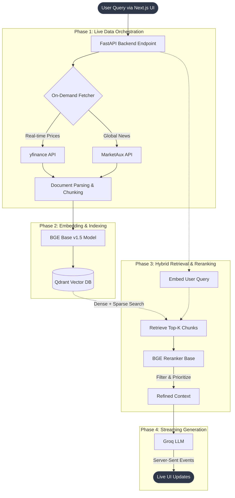

# Streaming RAG Pro: Real-Time Intelligence Engine

Welcome to **Streaming RAG Pro**, a production-grade, full-stack Retrieval-Augmented Generation (RAG) system engineered for high-fidelity, real-time financial data synthesis.

Unlike traditional RAG systems that rely on static, pre-indexed documents, Streaming RAG Pro is built from the ground up to operate on **100% Live Ingestion**. It continuously orchestrates the retrieval of real-time ticker data and global market news, dynamically structuring this volatile data into a high-performance vector space to answer user queries with up-to-the-second accuracy.

## The Problem It Solves: The Stale Data Dilemma in RAG

Standard RAG architectures are fundamentally flawed when applied to dynamic environments like financial markets, news cycles, or live system monitoring. The core issues are:

- **Data Obsolescence**: By the time a static PDF or database dump is embedded and indexed, the information is already outdated. In finance, a 15-minute delay renders insights useless.
- **Context Fragmentation**: LLMs often hallucinate or provide generalized advice when they lack immediate, grounded context of the *current* state of affairs.
- **Latency Bottlenecks**: Processing fresh data, embedding it, reranking, and generating a coherent response typically introduces unacceptable delays for end-users expecting conversational speed.

**Streaming RAG Pro** solves this by bypassing static files entirely. It utilizes a background orchestrator that fetches live market data the moment a query is initiated. It employs **Hybrid Search** (dense vector + sparse keyword) combined with **BGE Reranking** to instantly surface the most critical data points. Finally, it uses **Server-Sent Events (SSE)** to stream the LLM's analytical output back to the user with zero perceived latency, delivering a seamless, real-time command center experience.

## System Architecture

The following flowchart illustrates the vertical data pipeline, from user query to real-time streamed response:



## Tech Stack
- **LLM**: Groq (via OpenAI-compatible API)
- **Framework**: LlamaIndex
- **Backend**: FastAPI
- **Vector Database**: Qdrant (Hybrid Search)
- **Embeddings**: BGE Base v1.5
- **Reranker**: BGE Reranker Base
- **Caching**: Redis
- **Frontend**: Next.js 14 (App Router)
- **Live Data**: yfinance + MarketAux API (100% Live Ingestion)
- **Styling**: Premium Vanilla CSS & Framer Motion

## Prerequisites
- Docker & Docker Compose
- Python 3.10+
- Node.js 18+
- API Key (Groq)
- MarketAux API Key (for live news)

## Getting Started

### One-Command Setup (Recommended)
You can launch the entire stack (Docker, Backend, and Frontend) with a single command using Git Bash or any Unix-like terminal:

```bash
./run.sh
```

This script automatically:
1. Starts the Docker containers (Qdrant & Redis)
2. Sets up the Python virtual environment and installs backend dependencies
3. Installs Node modules for the frontend
4. Starts both the FastAPI backend and Next.js frontend in parallel
5. Gracefully handles shutdown of all services when you press `Ctrl+C`

### Manual Setup
If you prefer to start services individually:

#### 1. Infrastructure
Spin up Qdrant and Redis using Docker:
```bash
docker-compose -f docker/docker-compose.yml up -d
```

#### 2. Backend Setup
```bash
cd backend
python -m venv venv
source venv/bin/activate  # Windows Git Bash: source venv/Scripts/activate
pip install -r requirements.txt
```

Create a `.env` file in the `backend` directory (see `.env` template) and add your API keys.

Run the backend:
```bash
python main.py
```

#### 3. Frontend Setup
```bash
cd frontend
npm install
npm run dev
```

Open [http://localhost:3000](http://localhost:3000) to start chatting.
## Future Scope & Roadmap

Streaming RAG Pro is constantly evolving to push the boundaries of real-time AI. Upcoming enhancements include:
- **Expanded Live Data Sources**: Integration with Reddit APIs for social sentiment analysis and SEC Edgar for live financial filings.
- **Advanced Agentic Routing**: Dynamic selection of specialized LLM agents based on query complexity and intent.
- **WebSocket Native Connections**: Migrating from SSE to full-duplex WebSockets for bi-directional live telemetry and faster interactions.

## Conclusion

By eliminating the dependency on static document indexing, **Streaming RAG Pro** bridges the gap between foundational LLM knowledge and real-time market reality. It is designed not just as a proof-of-concept, but as a production-ready blueprint for next-generation intelligence applications.
