# ⚡ Streaming RAG Pro - Intelligence Command Center (Frontend)

Welcome to the frontend of the **Streaming RAG Pro** intelligence command center. This high-fidelity, Next.js-based application serves as the user interface for our real-time Retrieval-Augmented Generation (RAG) system. It is designed to provide a seamless, animated, and responsive experience for querying dynamic data (like live stock trends) and interacting with streaming LLM responses.

## ✨ Key Features

- **Real-Time Streaming Chat:** Instant, token-by-token responses with live citation tracking using Server-Sent Events (SSE).
- **Live Telemetry Dashboard:** A comprehensive command center view utilizing Recharts to track ingestion rates, vectorization metrics, and query latency in real-time.
- **Premium UI/UX:** Built with modern design principles—vibrant dark mode, glassmorphism, responsive layouts, and fluid micro-animations.
- **Optimized Performance:** Leverages Next.js App Router and `next/font` for rapid loading and smooth interactions.

## 🚀 Quick Start

Ensure the backend RAG engine is running on port `8000` before interacting with the frontend.

First, install the dependencies and run the development server:

```bash
npm install
npm run dev
```

Open [http://localhost:3000](http://localhost:3000) with your browser to launch the Command Center.

## API Integration & Architecture

This frontend is designed to interface with the FastAPI Python backend, enabling real-time streaming responses and live telemetry tracking.

### Connection Diagram

```mermaid
sequenceDiagram
    participant UI as Next.js Frontend
    participant Hooks as React Hooks (useStreaming / useTelemetry)
    participant API as FastAPI Backend (Port 8000)
    participant RAG as RAG Engine (LlamaIndex)

    %% Telemetry Flow
    rect rgb(30, 30, 30)
    Note over UI,API: Telemetry Polling (Every 3s)
    UI->>Hooks: useTelemetry(enabled=true)
    Hooks->>API: GET /api/telemetry
    API-->>Hooks: JSON { active_queries, latency, ingestion_rate }
    Hooks-->>UI: Update Telemetry Dashboard
    end

    %% Streaming RAG Flow
    rect rgb(30, 30, 30)
    Note over UI,RAG: Real-Time Chat Query (SSE)
    UI->>Hooks: sendMessage("query")
    Hooks->>API: POST /api/stream { query }
    API->>RAG: get_query_engine(streaming=True)
    
    RAG-->>API: Stream Tokens
    loop Server-Sent Events (SSE)
        API-->>Hooks: data: {"token": "..."}
        Hooks-->>UI: Append to Chat Message
    end
    
    RAG-->>API: Source Nodes
    API-->>Hooks: data: {"sources": [...]}
    Hooks-->>UI: Render Citations
    
    API-->>Hooks: event: done
    Hooks-->>UI: Finalize Message State
    end
```



### Key Endpoints

- **`POST /api/stream`**: Primary endpoint used by the `useStreaming` hook to receive Server-Sent Events (SSE) for real-time text generation and document sources.
- **`GET /api/telemetry`**: Polled by the `useTelemetry` hook to update the dashboard with system metrics like ingestion rate and latency.
- **`POST /api/query`**: Alternative synchronous RAG endpoint.
- **`GET /health`**: Health check to ensure the backend engine is initialized.

